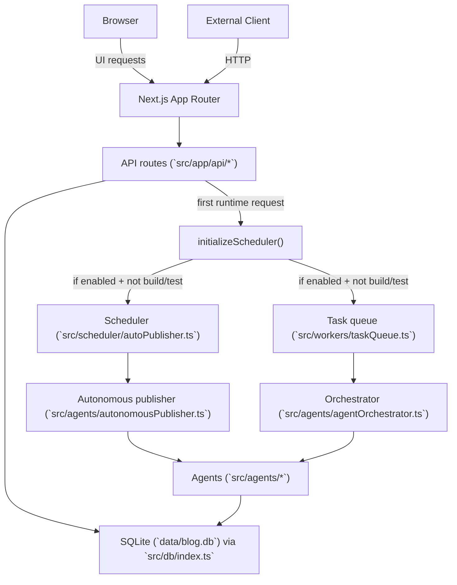

# Architecture

AI Auto News is a Next.js app (App Router) that serves:

- a UI (`src/app/*`)
- JSON API routes (`src/app/api/*`)
- a local SQLite-backed data layer (`src/db/*`)
- optional background services (scheduler + task queue)

## Runtime data flow (high level)

## Key subsystems

### Next.js UI and routing

- UI pages live under `src/app/`.
- API endpoints are implemented as Next.js route handlers under `src/app/api/`.

### Database (SQLite)

- SQLite database file: `data/blog.db`
- Driver: `better-sqlite3`
- Schema creation is performed in-process on first DB open (`src/db/index.ts`).

### Background services

`src/lib/scheduler-init.ts` controls whether background services start:

- disabled automatically during builds/tests
- enabled/disabled via env vars:
  - `SCHEDULER_ENABLED`
  - `TASK_QUEUE_ENABLED`

The scheduler (`src/scheduler/autoPublisher.ts`) periodically calls the autonomous publisher. The task queue (`src/workers/taskQueue.ts`) polls tasks from SQLite and runs orchestration handlers.

### Content pipeline

The “happy path” for automatic publishing is:

1. Research (`src/agents/researchAgent.ts`)
2. Generate (blog/news agent)
3. Format (`src/agents/formattingAgent.ts`)
4. Persist post (`src/db/posts.ts`)

## Experimental / not-wired modules

This repository contains many “platform-like” modules under `src/lib/` and additional API versions under `/api/v2` and `/api/v3`.

- Treat them as **experimental** unless a feature is clearly wired into the main runtime flows described above.
- Documentation focuses on the endpoints and flows that are demonstrably used by the app today.

